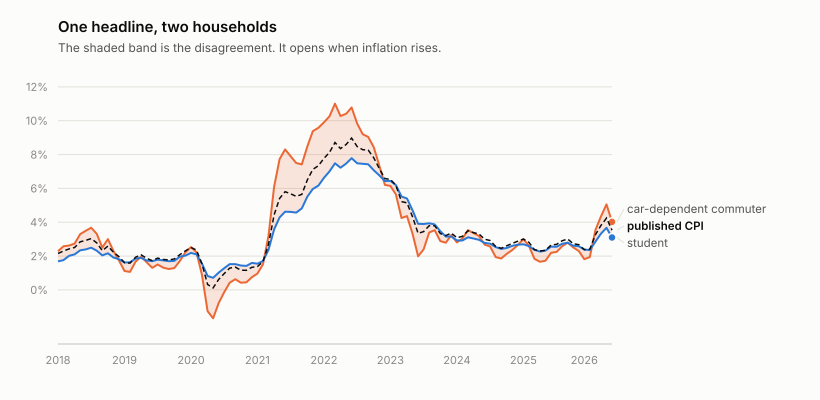
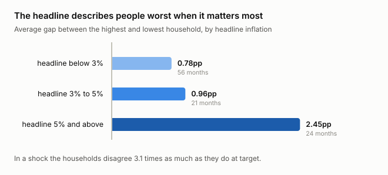

# whose-inflation

The news says inflation is 3%. Your rent went up 9%. This works out which of
those is wrong, and the answer turns out to be neither.

## What this is

Inflation gets reported as one number, and that number is an average across a
basket of everything people buy, weighted by how much of it they buy. A
household spending 45% of its budget on housing, 17% on transport and 8% on
medical care would feel exactly the rate that gets announced.

Almost nobody has that budget. The average is real, carefully measured, and
describes a composite household that does not exist.

So the question I actually wanted answered was: how much does that matter? Not
rhetorically — numerically. If I rebuild the index with a different basket, one
belonging to someone specific, how far does it move?

To ask that honestly I first had to prove I could rebuild the official number
at all. That check is the first command in the tool, and it is the reason to
believe anything after it.

## What I found

Two things. The first I expected. The second is the one I would actually talk
about.

### The reconstruction works

Take the eight published component indices, weight them by the published
relative importances, and you recover the headline rate to a mean absolute
error of **0.083 percentage points** across 101 months — against a figure BLS
itself publishes to one decimal place.

```
months compared      101
mean absolute error  0.083 pp
worst month          0.42 pp (2021-05)
```

That matters because everything else here is the same arithmetic with one
table changed. If the official weights had not reproduced the official index,
the sensible response would have been to stop and find out why, not to publish
household comparisons built on a method that demonstrably does not work.

The residual error is not noise either. It peaks in 2021, and it peaks there
because I use one year's weights across a decade while BLS re-estimates them
annually. The rebuild drifts most exactly where real spending patterns moved
most. That is a satisfying kind of error: it has a reason.

### Households disagree three times as much in a shock

This is the finding, and it is not the one I set out to demonstrate.

<picture>
  <source media="(prefers-color-scheme: dark)" srcset="docs/figures/band-dark.svg">
  
</picture>

I assumed different households would simply live at different inflation rates,
persistently, and that the gap would compound into something large over ten
years. It does not. Averaged over the decade the baskets land within about a
point of each other, and the cumulative difference is around 1%. On a ten-year
view the headline is a decent summary of most people.

What actually happens is that the disagreement is **concentrated in the
shock**:

```
headline inflation        months    mean spread between households
below 3%                      56                            0.78pp
3% to 5%                      21                            0.96pp
5% and above                  24                            2.45pp
```

<picture>
  <source media="(prefers-color-scheme: dark)" srcset="docs/figures/regimes-dark.svg">
  
</picture>

Three times wider. In March 2022 the headline was 8.7%, and inside that single
number the car-dependent commuter was living **11.0%** while the student was
living **7.5%**.

So the number is least representative at the exact moment people most need it
to mean something. In calm times one figure describes nearly everyone well
enough that the distinction is academic. In a shock it describes nobody, and it
is precisely then that it is quoted hardest — in pay negotiations, in benefit
uprating, in central bank press conferences.

That also explains a thing people say during inflationary episodes, which is
that it feels worse than the official figure admits. For a lot of baskets, it
genuinely is worse. Not because the statistic is wrong. Because it is an
average, and averages hide their tails exactly when the tails get long.

## Using it

```sh
git clone https://github.com/FinnTech3/whose-inflation
cd whose-inflation
pip install .
```

```sh
whoseinflation verify       # rebuild the official index and check it
whoseinflation weights      # what each basket assumes, and why
whoseinflation households   # each household against the headline
whoseinflation regimes      # the finding
```

Ten years of BLS data ship inside the package, so everything runs offline and
the numbers above reproduce exactly. That is deliberate — see below.

## How it works

### The verification comes first, on purpose

I could have written the household comparison first. It is the interesting
part, and it would have produced a chart immediately.

Doing it that way would have meant publishing a number with no way of knowing
whether the machinery producing it was sound. The reconstruction check is
cheap, it is decisive, and it either passes or the project has no foundation.
There is a test asserting it holds, and a second test that feeds it
deliberately wrong weights to confirm the check can actually fail — a
verification that passes everything verifies nothing.

### The weights are the argument, so they are readable

Every basket lives in one table with a written rationale next to it. The
official weights are sourced and exact. The household variants are mine, built
by shifting shares in the directions the Consumer Expenditure Survey documents,
and they are labelled as assumptions rather than presented as statistics.

`whoseinflation weights` prints each basket with the reasoning, because a
weight without a stated reason is just a number somebody picked. If you think
the retired household should spend less on medical care, the number is in one
obvious place and re-running takes a second.

### Year-on-year, never month-on-month

The published index is not seasonally adjusted, so comparing consecutive months
mostly measures the seasons — heating in January, airfares in July — rather
than inflation. Every comparison here is against the same month a year earlier.

### The data is committed, not fetched

BLS rate-limits the keyless tier hard, and I hit the daily cap partway through
building this. Depending on the API at runtime would make results
unreproducible and the tool unusable on a bad day, so the response is committed
inside the package and the analysis never touches the network.

## Two things in the data that would have gone unnoticed

**Some values are the string `"-"`.** Not null, not zero — a hyphen sitting in
a field the schema calls numeric. Nine of them in the ten years loaded here.
Coerce blindly and it crashes; coerce with a forgiving `float(v) or 0` and you
have inserted a zero index level, which reads as prices falling 100% and then
fully recovering the following month. It would show up as a spike so large it
might well be mistaken for a real event.

**Annual averages arrive tagged `M13`.** They sit in the same array as monthly
observations and look exactly like data. Treat them as a thirteenth month and
every year gets counted an extra time, with a value that is by construction the
average of the other twelve — so nothing looks obviously wrong, the series just
becomes quietly wrong.

Both are handled, and both are counted rather than silently dropped, so
`verify` can report how many it saw.

## Decisions and trade-offs

**One year's weights across a decade.** BLS re-estimates relative importances
annually; I apply the December 2023 set throughout. This is the largest
simplification here and it is measurable rather than hypothetical — it is most
of the 0.083pp reconstruction error, and it is why the error peaks in 2021.
Using period-correct weights would tighten the rebuild and complicate the
household comparison, since the household baskets would then need to move too.

**A weighted sum of group rates, not a chained index.** Over a twelve-month
window these agree closely because weights barely move inside a year. Over
longer spans they diverge and the chained calculation is the correct one. The
size of the approximation is exactly what `verify` measures.

**Eight major groups, not the full detail.** The CPI decomposes far further
than eight categories. Gaps concentrate in specific items — petrol rather than
"transportation" — and going deeper would sharpen the commuter result
considerably. Eight is where the published relative importance table lives,
which makes it the level at which the reconstruction can be verified.

**The household baskets are illustrative.** They are informed by documented
spending patterns, not measured from microdata. The official comparison is
exact; the household ones are honest estimates and are labelled as such
everywhere they appear.

**US data.** BLS publishes an API. ONS retired theirs in November 2024, which I
discovered by calling it, so the UK version of this project would need a
different data path.

## Testing

26 tests, all offline against the committed BLS response.

The two that matter are guards rather than unit tests:

- **the rebuilt index must match the published one** to within 0.1pp, because
  every other result is that same calculation re-weighted
- **the spread must widen with inflation**, because every other test would
  still pass if the baskets quietly became identical, at which point the
  project would say nothing at all

There is also a test that feeds deliberately wrong weights to the verifier and
asserts it fails, since a check that cannot fail is decoration.

## What I would do differently

**Go below the group level.** The commuter result is diluted by sitting inside
"transportation" alongside vehicle purchases and insurance. Petrol on its own
would show a far sharper picture, and the same is true of rent inside housing.

**Use period-correct weights.** Annual re-weighting would remove most of the
remaining reconstruction error and make the 2021 comparison more trustworthy.

**Build the baskets from microdata.** The Consumer Expenditure Survey publishes
spending by income quintile and age. Deriving the weights rather than reasoning
about them would move the household results from illustrative to measured, and
that is the single biggest upgrade available here.

**Compare against BLS's own alternative indices.** There is an experimental
elderly index, CPI-E, built for roughly the population my retired basket
approximates. Checking mine against it would be a real external test. I ran out
of API quota before I could pull it, which is its own small lesson about
building on rate-limited public data.

## Sources

US Bureau of Labor Statistics, CPI-U, US city average, not seasonally adjusted,
via the public API v1. Relative importance weights from the CPI news release
relative importance table, December 2023. See [docs/SOURCES.md](docs/SOURCES.md).

## License

MIT. See [LICENSE](LICENSE).
